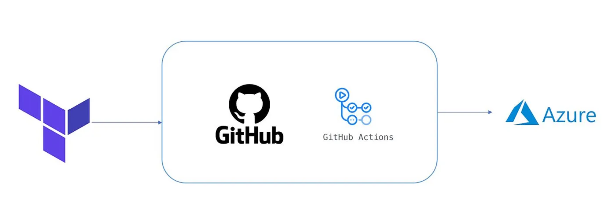

# Project # 1

How to provision Azure infrastructure using Terraform and GitHub Actions using OIDC authentication Azure , and  a CI/CD pipeline  with some security features to deploy a linux VM server in Azure subscription.

